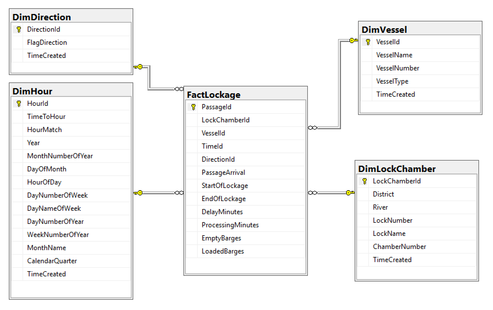

# United States Army Corps of Engineers Lock Delay Data Exploration

This little project shows the result of 
using the Microsoft SSIS and SSAS
tools as they apply to a freely available dataset of slightly
more than 800,000 rows. (SSIS is SQL Server Integration Services and SSAS is
SQL Server Analysis Services.)

The goal of this project is to tell my story of learning the SSIS/SSAS
tools within the context of an interesting problem. This document is not 
a tutorial on how to use the Microsoft data tools. Microsoft and YouTube 
have lots of tutorials about the usage of each tool or step.

--------------------------------------------
## About the data

The dataset for this project provides the following facts for the period 1 Jan 2016
through 30 Jun 2017.
- Corps district
- River
- Lock number
- Lock name
- Chamber number
- Vessel number
- Vessel name
- Direction (up river or down river)
- Arrival time
- Lockage start time
- Lockage end time
- Delay minutes (start time - arrival time)
- Processing minutes
- Empty barges
- Loaded barges

The raw data for this project can be found at 
[Corps Locks Queue Archive](https://data.navigationdatacenter.us/Locks/Corps-Locks-Queue-Archive/nfqq-pxqr).
I exported the data in CSV format.

---------------------------------------
## From raw data to human understanding
There are many process models and technologies that 
take us from raw data to understanding what the data are telling us. (I 
intentionally ignore machine learning and automated actions in this note.)

A typical process flow for data analytics is:
- Find a problem or ask a question
- Find data related to the question
- Build a data warehouse star or snowflake schema to store the raw data for rapid reporting.
- Process the source data into the data warehouse.
- Create a more compact analysis model with pre-built aggregates for rapid analysis.
- Explore and visualize the data to tell a story.

### How much river traffic is there in the United States?

During the time I lived in Louisville, KY, I often saw commercial barge
tows passing through the city on the Ohio River. I got curious and wanted
know more. (Plus I wanted to learn the Microsoft SSIS and SSAS tools.)

### Related data

The United States Army Corps of Engineers (USACE) posts public datasets
at https://data.navigationdatacenter.us/browse. Two datasets seem
interesting -- Corp Locks Queue Archive and the Summary Tonnage
Visualization. The queue archive has more data fields (facts), but only
covers one and one-half years. The tonnage visualization covers eight 
and one-half years but only provides an event (probably a single lock 
operation). Since this project is as much about using the tools as 
answering questions, the more complex queue archive data are used.

### Build a data warehouse

 

The shows the simple star schema for the data warehouse. 
Dimensions were created for the datetime down to the hour,
the vessel, travel direction, and the lock chamber.

The hour dimension was used in order to be able to 
examine time of day factors in the future, especially in the locks with 
less commercial locks such as Lake Union in Seattle. A fact 
is attached to an hour dimension based on the start of
lockage time value. All times in the dataset are local
civil time at the lock.

The vessel dimension as designed here works fine for 
commercial traffic with barges, but gets problematic with
the Chittendon Locks (aka Ballard Locks) on the Lake 
Washington Ship Canal in Seattle, WA. Vessel names like 
COMMERCIAL GENERIC, REC VESSELS UPBOUND, and RECREATIONAL
will not be helpful in detailed analysis.

The direction dimension indicates if the lock chamber was
operating in the upstream (U) or downstream (D) direction.

The lock chamber dimension is straightforward and identifies
the USACE district (field office), river, lock and chamber.
(A single lock may have muliple chambers to accomodate
traffic.)

The single fact table contains all of the aggregate data
available for analysis.

### Process the source data into the warehouse (SSIS)

This project processes the data into the data warehouse with
Microsoft's SQL Server Integration Services (SSIS).

Package developement was performed using Visual Studio 2017 and the 
SQL Server data tools add-in. Package development and testing is
performed in the the Visual Studio environment and then the 
packages are deployed to a SQL Server instance for production use.
Once installed on a server, the packages can be scheduled to run
by a SQL Server Agent job or by using command scripts. One of the
key benefits of SSIS and development within Visual Studio is the
ability to use a source control system such as Git to control the 
SSIS source elements.

The packages for this project are:
1. CreateDimAndFactTables
2. InputLockQueue
3. LoadDwDimensions
4. LoadDwFactLockQueue

#### 1. CreateDimAndFactTables

This package is best run only once since it destroys and 
re-creates all tables. At its heart, this package is a single
SQL script embedded in the package's single control flow task.

#### 2. InputLockQueue

The Input Lock Queue package uses simple SSIS transformations to 
read the CSV flat file and load the InputLockQueue table in the
data warehouse database. The InputLockQueue table is the
transformed raw input table.

#### 3. LoadDwDimensions

This package consists of three data flow tasks with only SQL Tasks 
at the control flow level. These SQL tasks contain scripts to find 
new dimensions in the InputLockQueue table and add new dimension values.

The beauty of SSIS (or other ETL tools) is the ability to embed SQL tasks
sequentially to control a potentially complex flow within a package that
the next analyst can use without worrying about sequencing.

#### 4. LoadDwFactLockQueue

The fact loading package uses the dimensions loaded at step 3 to add
dimension table keys to the processing stream and write fact records
to the FactLockage table.

### Create a compact analysis model (SSAS)

The main purpose of SSAS is to build small data structures that can
be quickly analyzed within a reporting tool such as Excel. Historically,
these compact structures were referred to as multi-dimensional modeling 
(MDM) cubes. MDM cubes are queried with an industry-standard language 
called MDX.

In order to create a compact structure, SSAS aggregates facts along dimensions 
using functions like AVERAGE(), SUM(), and COUNT(). If you get rid of all
those pesky rows, you can shrink the dataset substantially. [But, you lose 
the ability to find individual facts easily.]

The wizards in SSAS do a very good job of creating an MDM cube from the
data warehouse tables and shrinking the deployed data. Again, find and use
web tutorials to complete your tasks.

### Explore the data

The [data exploration document](outputDocs/Explore.pdf) shows the results
of some simple data exploration and analysis.

-------------------------------
## Lessons Learned

- SSIS is a mature (> 10 years old) tool set that seems to be solid, but somewhat limited (or difficult to use) compared to other ETL tools.
- SQL Server must be set up to process either MDM models or Microsoft tabular models. The two types of SSAS models cannot be mixed within a single SQL Server instance.
- Preliminary results from the exploration stage must be confirmed from external sources. See [data exploration document](outputDocs/Explore.pdf).

